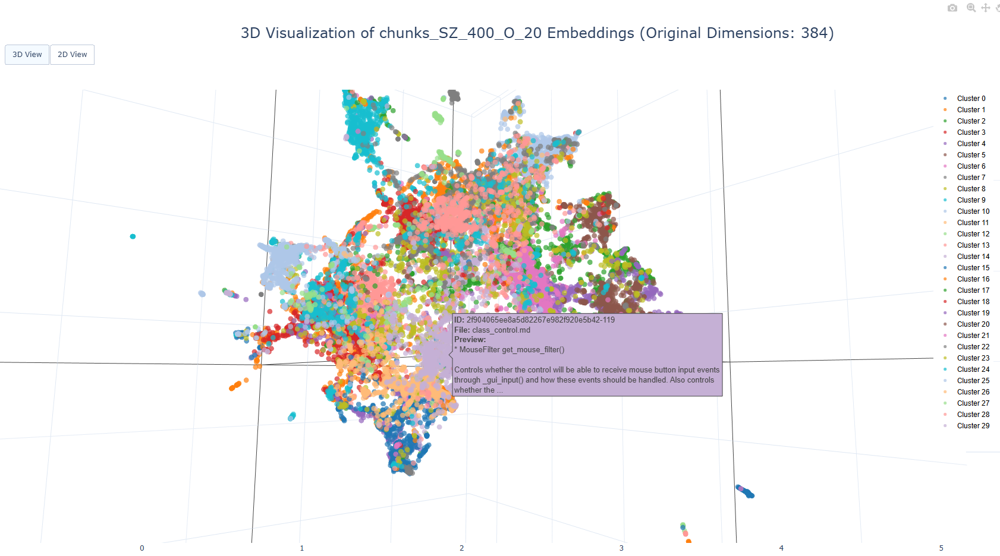

# website2embeddings

[中文](README_cn.md)

A complete pipeline for downloading, processing, and creating vector embeddings from the Godot documentation. This project allows you to create searchable semantic embeddings from web content and visualize them in 2D/3D space.

> **Note:** The curated Godot website is included in the repository (`artifacts/curated/godotengine`) as it takes a long time to download and process. You can start directly with the text chunking step if you want to work with the Godot documentation.


[Interactive Visualization](assets/visualization_example.html)

## Installation

1. Clone this repository:
   ```bash
   git clone https://github.com/zivshek/website2embedding.git
   cd website2embedding
   ```

2. Create and activate a virtual environment (recommended):
   ```bash
   # Windows
   python -m venv venv
   venv\Scripts\activate

   # Linux/MacOS
   python -m venv venv
   source venv/bin/activate
   ```

3. Install dependencies:
   ```bash
   pip install -r requirements.txt
   ```

## Getting Started

The repository includes pre-curated Godot documentation, so you can quickly try out the pipeline:

### Quick Start with Existing Data

1. Generate text chunks from the curated Godot documentation:
   ```bash
   python chunker.py --input artifacts/curated/godotengine --chunk-size 400 --chunk-overlap 20
   ```

2. Create vector embeddings:
   ```bash
   python vectorizer.py --input artifacts/chunks/godotengine_chunks_SZ_400_O_20.jsonl
   ```
   it will log the collection name to artifacts/collections.txt, so you can copy it for other uses later.

3. Visualize the embeddings:
   ```bash
   python visualizer.py --collection godotengine_chunks_SZ_400_O_20_sentence-transformers_all-MiniLM-L6-v2
   ```

### Full Pipeline with New Content

To process new web content from scratch:

1. Add URLs to `websites_to_download.txt`, then download the content:
   ```bash
   python downloader.py
   ```

2. Follow steps 2-5 in the Workflow section below.

## Overview

This project provides a comprehensive workflow for:

1. Downloading web content (such as Godot documentation)
2. Curating the content by cleaning and converting to markdown
3. Chunking the text into manageable segments
4. Creating vector embeddings of the text chunks
5. Visualizing the embeddings in 2D/3D space

## Prerequisites

- Python 3.8+
- Required Python packages (installed via requirements.txt)
- Sufficient disk space for downloaded content and vector database

## Project Structure

```
website2embedding/
├── downloader.py       # Downloads web content
├── page_curator.py     # Cleans HTML and converts to markdown
├── chunker.py          # Splits text into chunks
├── vectorizer.py       # Creates vector embeddings
├── visualizer.py       # Visualizes embeddings in 2D/3D
├── websites_to_download.txt  # List of websites to download
├── artifacts/         # Directory for all generated files
    ├── downloaded_sites/  # Raw downloaded HTML
    ├── curated/         # Cleaned markdown files
    ├── chunks/          # Text chunks in JSONL format
    ├── chroma_db/       # Vector database
    └── visualizations/  # 2D/3D visualizations
```

## Workflow

### 1. Download Web Content

Downloads HTML content from websites listed in `websites_to_download.txt`:

```bash
python downloader.py --delay 1.0
```

Options:
- `--delay` / `-d`: Delay between requests in seconds (default: 1.0)

### 2. Curate Content

Clean HTML and convert to markdown format:

```bash
python curator.py --input artifacts/downloaded_sites/site_domain
```

Options:
- `--input` / `-i`: Input directory with downloaded HTML (default: artifacts/downloaded_sites)

### 3. Create Text Chunks

Split markdown files into manageable chunks:

```bash
python chunker.py --input artifacts/curated/site_domain --chunk-size 400 --chunk-overlap 20
```

Options:
- `--input` / `-i`: Input directory with markdown files
- `--chunk-size` / `-s`: Maximum size of chunks in characters (default: 400)
- `--chunk-overlap` / `-v`: Overlap between chunks in characters (default: 20)

### 4. Create Vector Embeddings

Generate embeddings and store in ChromaDB:

```bash
python vectorizer.py --input artifacts/chunks/chunks_SZ_400_O_20.jsonl --db artifacts/vector_stores/chroma_db
```

Options:
- `--input` / `-i`: Input JSONL file containing text chunks
- `--db` / `-d`: Directory for ChromaDB vector database (default: artifacts/chroma_db)
- `--model` / `-m`: Name of the sentence-transformer model (default: sentence-transformers/all-MiniLM-L6-v2)
- `--batch-size` / `-b`: Batch size for embedding generation (default: 32)

### 5. Visualize Embeddings

Create interactive 2D/3D visualizations of embeddings:

```bash
python visualizer.py --collection chunks_SZ_400_O_20_sentence-transformers_all-MiniLM-L6-v2
```

Options:
- `--db` / `-d`: ChromaDB database directory (default: artifacts/chroma_db)
- `--collection` / `-c`: Name of the collection in ChromaDB (default: godot_docs)
- `--max-points` / `-m`: Maximum points to visualize (default: 2000)
- `--seed` / `-s`: Random seed for reproducibility (default: 42)
- `--clusters` / `-k`: Number of clusters for coloring (default: 10)

## Visualization Features

The visualizations include:
- Interactive 2D/3D toggle
- Cluster coloring for semantic grouping
- Hover for detailed document information
- Dynamic resizing and exploration

## Example Use Case

This project was designed to process Godot documentation, but can be adapted for any web content. Potential applications include:
- Technical documentation exploration
- Semantic search engines
- Content organization and discovery
- Document similarity analysis

## Notes

- The `.gitignore` is set up to exclude the artifacts directory to avoid committing large files.
- For large websites, consider adjusting the delay in `downloader.py` to avoid rate limiting.
- Vector embeddings require significant memory for large collections.